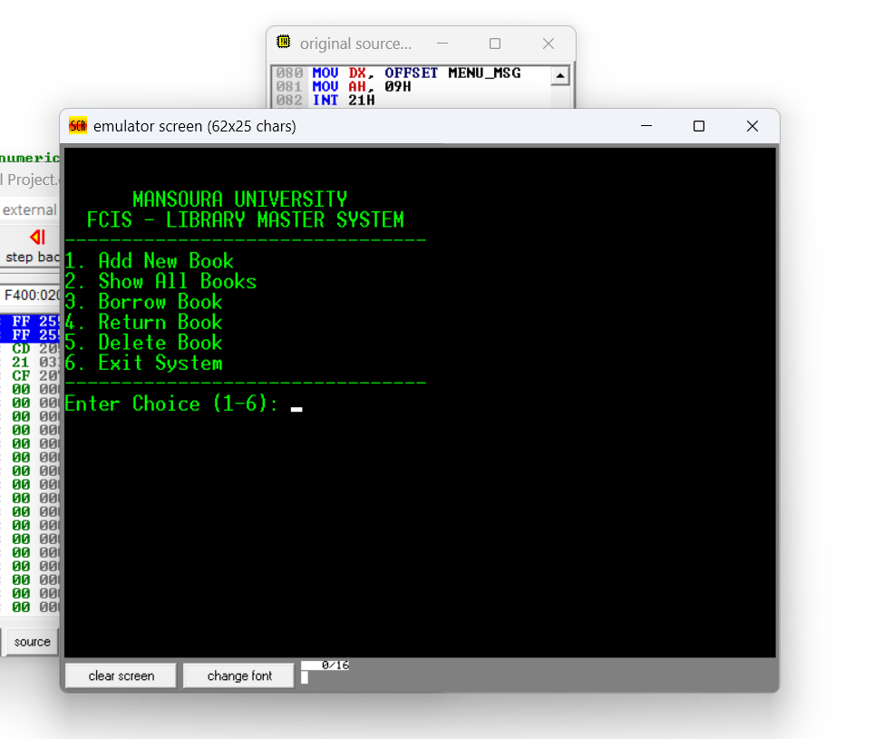

# Library Management System (x86 Assembly)

## Project Overview

This repository contains a fully functional **Library Management System** written in x86 Assembly Language, created as a Year 3 student project for the Computer Science Department, Faculty of Computers & Information Sciences (FCIS), Mansoura University. The system demonstrates mastery of low-level programming, parallel array management, interrupt-driven operations, and robust input validation.

### Technical Highlights

- **Parallel Arrays:** Efficient structuring and manipulation of book records (ID, Title, Status).
- **DOS & BIOS Interrupts:** Uses `INT 21h` and `INT 10h` for screen handling and keyboard I/O.
- **Input Validation:** Strict checking of numeric and empty input with clear user error messages.
- **Modular Procedures:** Each core function (add, delete, borrow, return) is separated for clarity and maintainability.

---

## Main Features

| Feature           | Description                                          |
| ----------------- | ---------------------------------------------------- |
| Add New Book      | Input new books with robust validation               |
| Show All Books    | Display all books with their status and titles       |
| Borrow Book       | Mark book status as "Borrowed"                       |
| Return Book       | Mark book status as "Available"                      |
| Delete Book       | Remove a book and shift arrays accordingly           |
| Robust Validation | Reject empty/non-numeric input, clear error messages |

---

## How to Run

1. **Install EMU8086:**  
   Download and install [EMU8086 Emulator](https://emu8086.com/download/).
2. **Open the Source:**  
   Open `Assembly Final Project.asm` in the EMU8086 IDE.
3. **Compile & Run:**  
   Use "Compile" then "Run" from within EMU8086.

---

## Video Demonstration

- ▶️ [Watch Video Demonstration](https://drive.google.com/file/d/1s0bD_sVqI5_6bKXNBRMei2ybQQ0JABGS/view?usp=drive_link)
- 📁 [All Project Files & Video Folder](https://drive.google.com/drive/folders/1qMDlRYkO0ixkturzf-oogqQ2IRd4Q2-u?usp=drive_link)

---

## Author

**Amr Mohamed Mahmoud** |
Faculty of Computers & Information Sciences (FCIS),
Computer Science Department — Year 3,
Mansoura University

---

## License

Released under the MIT License.
